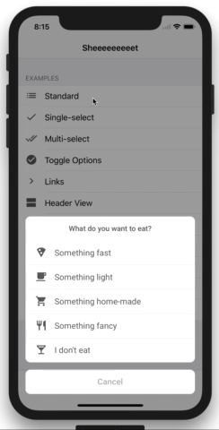

# Sheeeeeeeeet

[](https://github.com/ellerbrock/open-source-badge/)
[](http://badge.fury.io/gh/danielsaidi%2FSheeeeeeeeet)
[](https://travis-ci.org/danielsaidi/Sheeeeeeeeet)


<p align="center">
    
</p>

## About Sheeeeeeeeet

Sheeeeeeeeet is a Swift library for adding custom action sheets to your iOS apps.
It comes with a set of built-in action sheet items and can be extended by custom
items that are more specific to your app/domain.

Sheeeeeeeeet action sheets can be designed to look just like standard iOS action
sheets or way different. You can apply a global appearance as well as individual
appearances for separate action sheets. You can even apply individual apperances
to single items.

Sheeeeeeeeet action sheets can be peeked & popped on all devices that support 3D
touch, with an optional long press gesture fallback for unsupported devices. You
can configure Sheeeeeeeeet to either pop just the header view or the full sheet.


## Demo Application

This repository contains a demo application. Open the `Sheeeeeeeeet` project and
run the `SheeeeeeeeetExample` target to try different types of action sheets.


## Install

Sheeeeeeeeet can be installed with `CocoaPods` and `Carthage`:

### CocoaPods

To install Sheeeeeeeeet with CocoaPods, add this line to your `Podfile`:

```
pod 'Sheeeeeeeeet'
```

then run `pod install`. For more info, visit the [CocoaPod website][CocoaPods].

### Carthage

To install Sheeeeeeeeet with Carthage, add this line to your `Cartfile`:

```
github "danielsaidi/Sheeeeeeeeet"
```

then run `carthage update`. For more info, visit [Carthage website][Carthage].


## Presenting an action sheet

Presenting custom action sheets with Sheeeeeeeeet is easy. Just create an action
sheet with a set of items, then present it in a view controller. To use popovers
on iPad, you can also provide the sheet with a `from` source view:

```
// This code is presumed to be in a view controller
func showAlert(tappedButton: UIView?) {

    let items = [
        ActionSheetTitle(title: "Select your favorite number"),
        ActionSheetItem(title: "One", value: 1, image: UIImage(named: "one"))
        ActionSheetItem(title: "Two", value: 2, image: UIImage(named: "two"))
        ActionSheetItem(title: "42", value: 42, image: UIImage(named: "42"))
        ActionSheetCancelButton(title: "Cancel")
    ]

    // Remember to keep a strong reference to the action sheet!
    self.actionSheet = ActionSheet(items: items) { (sheet, item) in
        guard let number = item.value as? Int else { return }
        print("Your favorite number is \(number)")
    }

    actionSheet.present(in: self, from: tappedButton)
}
```

It is important to keep a strong reference to the action sheet, otherwise it may
be deallocated while being presented.


## Components

Sheet comes with some built-in `items`, `buttons`, `titles` and `views` that can
be used to compose flexible action sheets.

### Items

Items are used to present options. Sheeeeeeeeet comes with these built-in types:

* [Standard Item][ActionSheetItem]
* [Select Item][ActionSheetSelectItem]
* [Toggle Item][ActionSheetToggleItem]
* [Link Item][ActionSheetLinkItem]

To create custom item types, inherit `ActionSheetItem` or an item type that best
suits your needs.

### Buttons

Buttons are used to discard or apply the effect of an action sheet. Sheeeeeeeeet
comes with these built-in types:

* [OK button][ActionSheetOkButton]
* [Cancel button][ActionSheetCancelButton]
* [Danger button][ActionSheetDangerButton]

To create custom button types, inherit `ActionSheetButton` or a button type that
best suits your needs.

Buttons are automatically separated from other items when you create your action
sheet instance, and are presented in a separate list. On popovers, however, they
are added back to the end of the item list, since popovers look different.

### Titles

Sheeeeeeeeet comes with some built-in components, that can be used to add titles,
sections, headers and margins to action sheets. They are also items, but have no
interactive use:

* [Title][ActionSheetTitle]
* [Section Title][ActionSheetSectionTitle]

To add some margin above a section title, add an `ActionSheetSectionMargin` item
before the section title.

### Header View

If you set the `headerView` property of an action sheet, it will be displayed as
a floating header above the action sheet options. You can use any view you like.

Header are completely removed in popovers, since popovers are solid bodies, with
no transparent space separating different content types.


## Appearance

Sheeeeeeeeet can be globally styled by using the `ActionSheetAppearance.standard`
instance. All action sheets then copies this instance when they are created, and
can thus be individually styled without affecting the global style. Action sheet
items then copies their action sheet's appearance and can be individually styled
as well.


## Peek and pop

Sheeeeeeeeet supports peek & pop on 3D touch devices. To enable this in any view
controller that implements `ActionSheetPeekSource` just create a strong instance
of `ActionSheetPeekHandler`. 

You must provide the peek handler with a source view, from where peeks originate.
This could e.g. be a collection or table view. The peek handler uses this source
view to determine the correct 3D touched frame.

ON devices that have no 3D touch support, the peek handler will fallback to long
presses. You can disable this by setting `longPressFallback` to `false` in `init`.


## Contact me

Feel free to reach out if you have any questions or if you want to contribute to
Sheeeeeeeeet:

* E-mail: [daniel.saidi@gmail.com](mailto:daniel.saidi@gmail.com)
* Twitter: [@danielsaidi](http://www.twitter.com/danielsaidi)
* Web site: [danielsaidi.com](http://www.danielsaidi.com)


[header-image]: SheeeeeeeeetExample/Assets/Images/title-image.png "Sheeeeeeeeeit"
[demo-gif]: Resources/device.gif "Example gif"

[Carthage]: https://github.com/Carthage/Carthage
[CocoaPods]: https://cocoapods.org/

[ActionSheetItem]: https://github.com/danielsaidi/Sheeeeeeeeet/blob/master/Sheeeeeeeeet/Sheeeeeeeeet/Items/ActionSheetItem.swift
[ActionSheetSelectItem]: https://github.com/danielsaidi/Sheeeeeeeeet/blob/master/Sheeeeeeeeet/Sheeeeeeeeet/Items/ActionSheetSelectItem.swift
[ActionSheetToggleItem]: https://github.com/danielsaidi/Sheeeeeeeeet/blob/master/Sheeeeeeeeet/Sheeeeeeeeet/Items/ActionSheetToggleItem.swift
[ActionSheetLinkItem]: https://github.com/danielsaidi/Sheeeeeeeeet/blob/master/Sheeeeeeeeet/Sheeeeeeeeet/Items/ActionSheetLinkItem.swift


[ActionSheetOkButton]: https://github.com/danielsaidi/Sheeeeeeeeet/blob/master/Sheeeeeeeeet/Sheeeeeeeeet/Items/ActionSheetOkButton.swift
[ActionSheetCancelButton]: https://github.com/danielsaidi/Sheeeeeeeeet/blob/master/Sheeeeeeeeet/Sheeeeeeeeet/Items/ActionSheetCancelButton.swift
[ActionSheetDangerButton]: https://github.com/danielsaidi/Sheeeeeeeeet/blob/master/Sheeeeeeeeet/Sheeeeeeeeet/Items/ActionSheetDangerButton.swift


[ActionSheetTitle]: https://github.com/danielsaidi/Sheeeeeeeeet/blob/master/Sheeeeeeeeet/Sheeeeeeeeet/Items/ActionSheetTitle.swift
[ActionSheetSectionTitle]: https://github.com/danielsaidi/Sheeeeeeeeet/blob/master/Sheeeeeeeeet/Sheeeeeeeeet/Items/ActionSheetSectionTitle.swift
