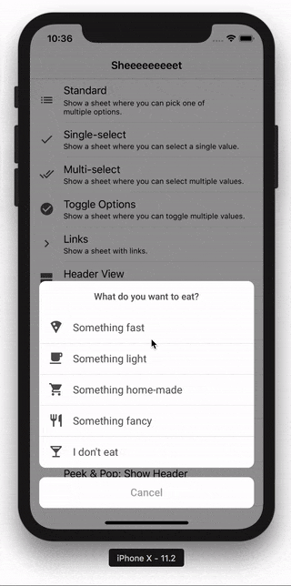

<p align="center">
    
</p>

<p align="center">
    <a href="https://github.com/danielsaidi/Sheeeeeeeeet">
        
    </a>
    
    
    
    <a href="https://twitter.com/danielsaidi">
        
    </a>
</p>


## <a name="about"></a>About Sheeeeeeeeet

Sheeeeeeeeet lets you create menus. These menus can then be used as context menus, action sheets or in any way you like, in UIKit or in SwiftUI.

<p align="center">
    
</p>

Sheeeeeeeeet comes with many item types (standard items, buttons, titles, toggles etc.) and can be extended with custom ones.

Sheeeeeeeeet's custom action sheets can be styled to look just like `UIAlertController`s or completely different. You can also customize how they are presented and dismissed.


## Installation

### <a name="spm"></a>Swift Package Manager

The easiest way to add Sheeeeeeeeet to your project in Xcode 11 is to use Swift Package Manager:
```
https://github.com/danielsaidi/Sheeeeeeeeet.git
```

### <a name="cocoapods"></a>CocoaPods

```ruby
pod "Sheeeeeeeeet"
```

### <a name="carthage"></a>Carthage

```
github "danielsaidi/Sheeeeeeeeet"
```

`IMPORTANT` There is currently problems with the Carthage installation, which cause Apple to reject apps that pull in Sheeeeeeeeeeet with Carthage. See [this issue](https://github.com/danielsaidi/Sheeeeeeeeet/issues/116) for more information. Until it's solved, use SPM or CocoaPods instead.

### <a name="manual-installation"></a>Manual installation

To add `Sheeeeeeeeet` to your app without a dependency manager, clone this repository, add `Sheeeeeeeeet.xcodeproj` to your project and `Sheeeeeeeeet.framework` as an embedded app binary and target dependency.


## Creating a menu

With Sheeeeeeeeet, you start off by creating a menu, like this:

```swift
let item1 = MenuItem(title: "Int", value: 1)
let item2 = MenuItem(title: "Car", value: Car())
let button = OkButton(title: "OK")
let items = [item1, item2, button]
let menu = Menu(title: "Select a type", items: items)
```

There are many built-in menu item types, e.g. selectable items, links, buttons, titles, collections, custom items etc. A complete list can be found [here][Item-Types].

### Present the menu as an action sheet

You can then present the menu as a custom action sheet:

```swift
let sheet = menu.toActionSheet(...) { sheet, item in ... }
sheet.present(in: vc, from: view, ...)
```

You can find more information in [this action sheet guide][Action-Sheets]. You can also read more about styling the sheets in [this appearance and styling guide][Appearance].


### Add the menu as a context menu

You can also apply the menu as an iOS 13 context menu to any view you like:

```swift
menu.addAsContextMenu(to: view, action: ...)
```

You can find more information in [this context menu guide][Context-Menus].


### Present the menu as an alert controller

You can also present the menu as a `UIAlertController`:

```swift
let delegate = menu.presentAsAlertController(in: self, from: view, action: ...)
```

You can find more information in [this alert controller guide][Alert-Controllers].


## <a name="advanced-example"></a>Advanced example

When you have the basics under control, check out [this advanced example][Advanced-Example] to see how you can take things further.


## Demo App

This repository contains a demo app that demonstrates different menus and menu items, including subclassing and appearance adjustments. To try it out, open and run the `Sheeeeeeeeet.xcodeproj` project.


## Contact me

Feel free to reach out if you have questions or if you want to contribute in any way:

* E-mail: [daniel.saidi@gmail.com][Email]
* Twitter: [@danielsaidi][Twitter]
* Web site: [danielsaidi.com][Website]


## License

Sheeeeeeeeet is available under the MIT license. See LICENSE file for more info.


[Email]: mailto:daniel.saidi@gmail.com
[Twitter]: http://www.twitter.com/danielsaidi
[Website]: http://www.danielsaidi.com

[Carthage]: https://github.com/Carthage
[CocoaPods]: http://cocoapods.org
[GitHub]: https://github.com/danielsaidi/Sheeeeeeeeet
[License]: https://github.com/danielsaidi/Sheeeeeeeeet/blob/master/LICENSE
[Pod]: http://cocoapods.org/pods/Sheeeeeeeeet
[SheeeeeeeeetRef]: https://www.youtube.com/watch?v=l1dnqKGuezo

[Action-Sheets]: https://github.com/danielsaidi/Sheeeeeeeeet/blob/master/Readmes/Action-Sheets.md
[Advanced-Example]: https://github.com/danielsaidi/Sheeeeeeeeet/blob/master/Readmes/Advanced-Example.md
[Appearance]: https://github.com/danielsaidi/Sheeeeeeeeet/blob/master/Readmes/Appearance.md
[Context-Menus]: https://github.com/danielsaidi/Sheeeeeeeeet/blob/master/Readmes/Context-Menus.md
[Item-Types]: https://github.com/danielsaidi/Sheeeeeeeeet/blob/master/Readmes/Item-Types.md
